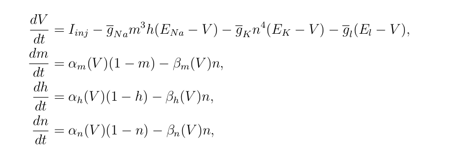
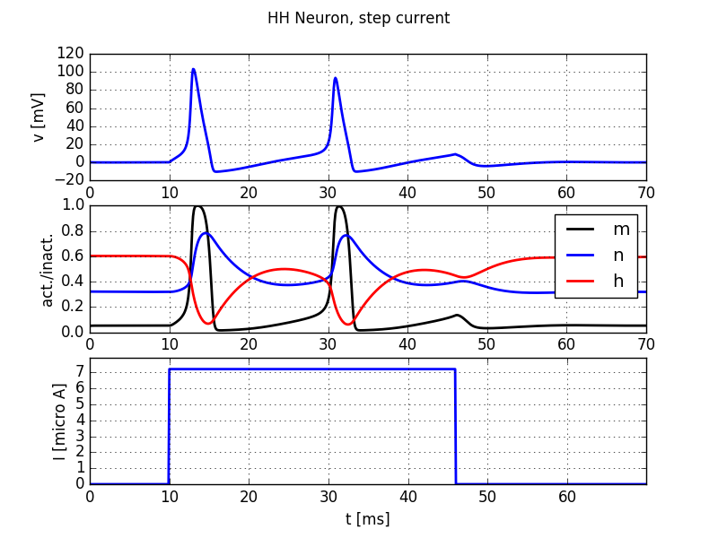
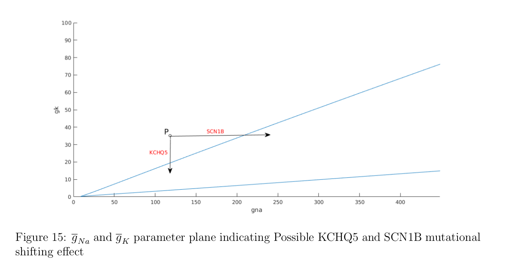

# Biomathematics final year project
## Hodgkin-Huxley-model 
The effects of neuron related disorders on the stability of the Hodgkin Huxley model

In this projects I did a bifucartion analysis with respect to the Sodium and Potassium maximum conductance paramaters in relation to two diseases that effect these paramaters and cause epilepsy. 

Outline:
The system of ODE's called the "Hodgkin Huxely equations" below where solved to find the steady state equilibrium for some value of maximum sodium and potassium conductance.

The solutions over time are shown below. The steady state is the convergence value of the variable as t -> infinity.

We then varied the maximum sodium and potassium conductance and plotted the steady states we got the following results.
The figure below shows the steadt states plotted. The mutation effects are shown as arrows. 

The results can be used to design new drugs relating to these diseases and functionally similar ones. 

implementation:
The code and figures where created using matcont in matlab and python.
